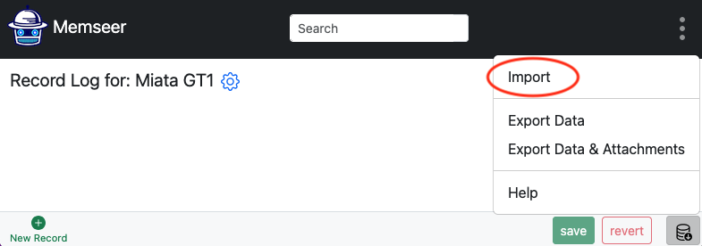
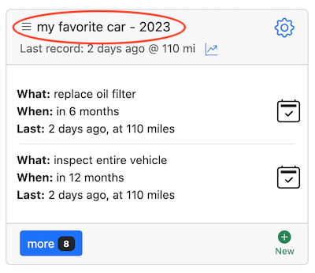

# Data management
{: .no_toc }

How to import & export data
{: .fs-6 .fw-300 }
---

Your data split into 2 parts: [Category](../guides/overview.md#category) (includes actions) and [Records](../guides/overview.md#records). Both parts are independent of each other and can be imported/exported separately.

---

- TOC
{:toc}

--- 

## Category

### Export

In order to export your category, go to dashboard, find the desired title and click edit category (gear image).

Next, scroll all the way to the bottom of the page and click on the database icon on the bottom right hand corner, click on "Export Data".

Click "Export Data" and the category file will be saved to your device under the category's name, for example:\
`Miata GT.csv`

### Import

In order to import a brand-new category, go to the main dashboard, scroll to the bottom and click on "New Category".

Next, write the name of the new category and click “save”. You will be redirected to the main dashboard where you will go back and click on the new category name. You will land on the record log for the new category. Which is currently empty.

Next, select the database icon and click on the "Import" button in the bottom right-hand corner.

Select an import file (example: `Miata GT.csv`) and in a second you will see the populated item.

---

## Events

### Export

When exporting, you have two options: export events only, or export events with file attachments. Let's first discuss how to export events:

#### Export Events
To export events, navigate to the dashboard and locate the desired item. Click on the item name.

Next, scroll to the bottom of the page and find the "Export Data" button on the right side.

Click "Export Data". The events file will be saved to your device under the item's name, for example:
`Miata GT.csv`

#### Exporting Events with Attachments

To export events with attachments, go to the dashboard, find the desired item, and click on the item name.

Then, scroll to the bottom of the page and locate the "Export Data & Attachments" button on the right side.

Click "Export Data & Attachments". A zip file will be saved to your device under the item's name, for example:
`Miata GT.zip`. This archive will contain `Miata GT.csv` along with all attached files. 

### Import

In order to import events, go to dashboard and click on the item's name.

Note: the item does NOT have "Last event:" and has a bunch of "Late" actions. This is normal since there are no events.

Click on item's name.

On the bottom right click "Import", select file (example: `Miata GT.csv`) and in a second you will see populated events.

